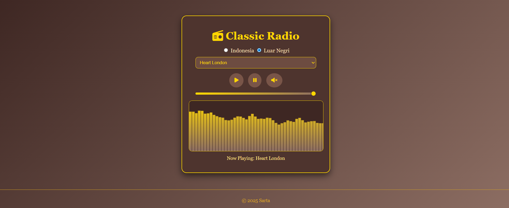
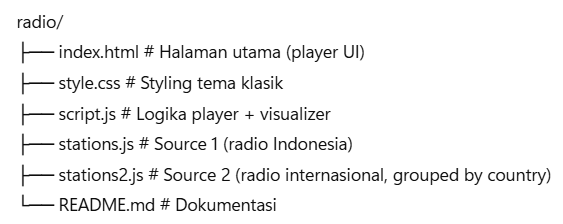

# 📻 Classic Web Radio Player

Web-based radio player sederhana dengan desain klasik berwarna coklat keemasan.  
Mendukung **visualizer audio**, **multi-source radio** (Indonesia & Internasional), dan kontrol playback dasar.

 <!-- tambahkan screenshot kalau ada -->

---

## ✨ Fitur
- 🎶 **Streaming Radio**: Putar berbagai stasiun radio lokal & internasional.  
- 🌍 **Multi Source**:
  - **Source 1** → Radio Indonesia  
  - **Source 2** → 100+ Radio Internasional (dikelompokkan per negara)  
- 📊 **Visualizer Audio**: Bar visualizer dengan gradasi coklat–emas.  
- 🔊 **Kontrol Pemutar**:
  - Play, Pause, Mute/Unmute dengan ikon dinamis
  - Volume slider (warna emas)
- 🎨 **UI Klasik**: Tema coklat keemasan, border emas, tampilan elegan.
- 🛠 **Support**: `.mp3`, `.aac`, `.ogg`, dan `.m3u8` (via HLS.js).

---

## 📂 Struktur Project

https://s4rt4.github.io/radio/

